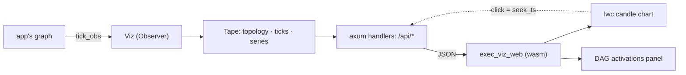

# Architecture

A replay viewer for a `trading_data` computation DAG. The graph is evaluated exactly
once, by the app that owns it; `exec_viz` only *watches* — it attaches as a
`trading_data_dag::Observer`, keeps what it saw on a tape, and serves that tape to a
browser that walks it tick by tick.

## The one idea

**The recording is the storage — and the storage can be a file.** The obvious design —
keep the graph, rewind it, re-run to tick *n* — assumes the run is reproducible. A live
feed is not: it happened once. So every tick is written down as it fires, and every replay
control is a cursor move over that write-down. Nothing is ever recomputed.

Because the tape is the whole of what a viewer reads, `Viz::save` can put it on disk and
`Viz::load` can open it again — a run recorded today is scrubbable next week, and whether
a UI was attached while it ran is a separate question from whether it was recorded. What
lands is what the tape held: a thinned run saves thinned, because that *is* the recording.
The file is `msgpack` behind a magic + a `TAPE_SCHEMA` that refuses a layout this build
does not read, rather than reinterpreting the bytes.

That single choice sets the shape of everything else:

- **The server reads a tape that is still being written.** `Viz::bind` is split from
  `Viz::serve_on` so the URL answers before the work begins, and every handler takes what
  has been recorded *so far*. Scrubbing a live run is the normal case, not a mode.
- **An op can outrun the recording.** Rather than block, the server answers with
  `pending: true` — "this ran out of recorded ticks, ask again later" — and the client
  re-issues, showing a `⟳` on the control that is chasing the feed.
- **The cursor floats at the live edge** until an explicit op parks it, and re-attaches by
  stepping past the head — the clamp in `Tape::step` is what makes "the end" addressable
  without an endpoint that names it.
- **A bounded buffer must not forget its front.** See *Thinning* below.

## Codemap

`exec_viz` (the library):

- `tape` — the whole model. `Viz` is a `Clone` handle over an `Arc<Mutex<Tape>>`: the
  recording side implements `Observer`, the read side is what the server scrubs. `Tape`
  holds the node `topology` (recorded once, on the first tick), the tick ring, the
  downsampled per-node `series` (`price_node`'s *is* the candle pane), and the cursor. Every replay op —
  `step`, `seek`, `seek_ts`, `step_until`, `step_until_change` — is a method here that
  moves the cursor and returns an `ActivationFrame`. `save` waits out the recording and
  writes the tape down; `load` opens one back, sealed, with no recorder.
- `server` — axum router and handlers, one thin `Json(...)` line each. Runtime-free:
  `serve_on` is a plain future taking an already-bound listener, so the app decides where
  it runs. Also serves the built `exec_viz_web` bundle (`EXEC_VIZ_WEB_DIR`) with an SPA
  fallback, and the chart shim's JS half.
- `api_types` — the wire shapes, and the only module that compiles without the `server`
  feature. That split is what lets the wasm client depend on this same crate for its
  types without dragging axum and tokio onto a wasm target.
- `record` — the `runs/{run_id}/` layout: `TAPE_FILE`, plus the row shapes (orders, fills,
  drawings) that sibling strategies each hand-roll today. The lanes other than the tape are
  still schema-only; their writers land with the first migration onto it.

`exec_viz_web` (the wasm front-end, `publish = false` — it is a bundle, not a crate):

- `state` — every `/api/*` call and the shared signals (`FRAME`, `PLAYING`, `SPEED`,
  `SELECTED`, `WAITING`). Each frame that lands also moves the chart's replay cursor.
- `views` — the status bar plus two `dockviewers` tiles (chart, DAG). Also the free-run
  poll loop and the two JS→Rust bridges (keys, chart clicks).
- `dag` — the activations panel: one column per topo level, a per-node element grid heat-
  colored by running min/max, and an SVG overlay whose edge weights are the tick's
  finite-difference Jacobian. A card is lit where it fired, cut where it is dormant.
- `keyboard` — a document listener forwarding our keys onto a channel; the component side
  drains it *inside* the dioxus runtime, because a bare JS closure has no runtime context
  to await an API call in.

## Thinning

A plain ring drops its oldest tick, which makes the beginning of a long recording
unreachable for the rest of the run — and since there is no re-run, unreachable is
permanent. Instead, once `capacity` is hit, `Tape::thin` keeps:

- the newest `capacity / 2` ticks **whole**, so the fresh stretch stays tick-exact, and
- over everything before them, a *backbone* of at most `capacity / 4` ticks — chosen by
  fire rather than by index.

**Decimating by tick index is proximity to the buffer, not to the problem.** What a human
scrubs a tape for is the rare event, and a fixed stride destroys precisely those: at spl's
318k ticks against a 20 000 tape the stride settled on 64, so a 5-minute bar that fired 576
times over the window kept nine of them, and pressing "next change" crossed five hours per
press.

So the unit of decimation is the *fire*. Every tick carries a `ranks` column — for each node
that fired on it, `trailing_zeros` of that node's fire ordinal — and "keep one fire in `2^k`
of node `i`" is then the single comparison `ranks[i] > keep[i]`. A tick survives if any node
claims it. `keep` is per node and rises max-min fairly: count the retained fires per node
over the pre-tail stretch, and while the union is over `capacity / 4`, raise the greediest
node's exponent by one. Busy nodes absorb the whole squeeze; a node that never dominates
never loses a fire.

The rank column is what makes that a *subset filter* rather than a re-selection: it is
computed once, on the tape thread, and the kept sets nest as `k` grows — so each pass still
keeps a subset of what the last one kept, still frees between a quarter and a half of the
buffer, and is still one O(capacity) pass per `capacity / 4` ticks. It rides on `Tick` and
not on `Acts` deliberately: the `Acts` buffers are the graph thread's, recycled across the
handoff, and `Rec::on`/`Rec::drop`/`Recorder::at` — the leg shared with live — are untouched
by any of this.

A node's very first fire has ordinal 0, whose `trailing_zeros` saturates above every `keep`,
so it survives every squeeze. That is what keeps the front of a long recording addressable
now that no index is privileged.

What to size `capacity` to is a measurement, not an argument: `exec_viz/examples/capacity.rs`
sweeps it for footprint, cursor latency and per-node addressability, and splices the block
into `docs/.readme_assets/other.md` (raw copy at `docs/capacity.txt`).

Three consequences worth knowing:

- **The cursor is absolute** (an index among all ticks ever opened, not a buffer
  position), so a thinning pass cannot slide a parked cursor out from under the user.
- **A carried-forward value is searched, not stamped.** A quiet node shows its last fired
  value; `Tape::held` scans back for it rather than remembering a tick number, because a
  remembered tick can be one a thinning pass has since dropped.
- **A step admits its own width.** Past the capacity one retained step covers several
  absolute ticks, so `ActivationFrame::gap` carries how many and the nav shows it. Likewise
  `found`: a search that reaches the end of a *sealed* recording without a hit leaves the
  cursor alone and says so, rather than answering a failed search by parking the user at the
  end of the run. While the tape is still growing that end *is* the resume point, and there
  the cursor does move — `pending` says the op will be re-issued from it.

The per-node chart series is *not* subject to any of this: it is downsampled online into
`bucket_ms` buckets on the way in, and kept for the whole run.

## Cross-cutting

- **The recording is off the trading core.** A fire's graph-side leg is an append and a channel
  push; naming, bucketing, thinning and the cost statistics are the tape thread's, which takes the
  handoff in batches — one lock per up-to-`BATCH` ticks, and only under backlog, since it drains
  what is already queued rather than waiting for a batch to fill. A thread rather than a future the
  app drives: under `Backpressure::Block` the producer waiting on it is that core, so absorption
  has to be unconditional.
- **Fail loudly.** Boot failures panic (`EXEC_VIZ_WEB_DIR` unset, bind failure). A
  `price_node` that names nothing, or names a node that is not five-wide, panics rather than
  drawing an empty candle pane. The tape's mutex
  is deliberately un-poisonable: every op leaves it consistent, and a panicking handler
  must not cost the run its recording.
- **Names are display-only.** `trim` shortens `type_name` strings by dropping module paths
  at every depth (a segment is a module iff it starts lowercase) so a node card reads as
  the types it names. `Buffering<C, J>` deps are rerouted onto the `Buffer<C, K>` node that
  serves them, and buffer nodes are dropped from the chart — a buffer's series is its
  source's element for element, so charting both draws every pane twice.
- **Dormancy is re-derived, not sent.** `fired` says a node did not run, never why: a clocked node
  between publications reads the same as one the sweep is skipping. Which gates suppress a node is a
  closure `trading_data_macros::demand` takes at compile time; the client retakes it over `deps` and
  `gates` against the tick's gate readings, so the wire keeps its shapes and none of the engine's
  internals. What the wire cannot name — folds, latches — `fired` vetoes.
- **Single-user study tool.** One mutex over the whole tape, linear scans for cursor ops.
  Both are marked `ponytail:` in the source with the upgrade path, and neither has come
  close to mattering.
