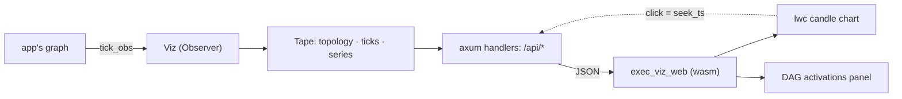

# Architecture

A replay viewer for a `trading_data` computation DAG. The graph is evaluated exactly
once, by the app that owns it; `exec_viz` only *watches* — it attaches as a
`trading_data_dag::Observer`, keeps what it saw on a tape, and serves that tape to a
browser that walks it tick by tick.

## The one idea

**The recording is the storage.** The obvious design — keep the graph, rewind it, re-run
to tick *n* — assumes the run is reproducible. A live feed is not: it happened once. So
every tick is written down as it fires, and every replay control is a cursor move over
that write-down. Nothing is ever recomputed.

That single choice sets the shape of everything else:

- **The server reads a tape that is still being written.** `Viz::bind` is split from
  `Viz::serve_on` so the URL answers before the work begins, and every handler takes what
  has been recorded *so far*. Scrubbing a live run is the normal case, not a mode.
- **An op can outrun the recording.** Rather than block, the server answers with
  `pending: true` — "this ran out of recorded ticks, ask again later" — and the client
  re-issues, showing a `⟳` on the control that is chasing the feed.
- **A bounded buffer must not forget its front.** See *Thinning* below.

## Codemap

`exec_viz` (the library):

- `tape` — the whole model. `Viz` is a `Clone` handle over an `Arc<Mutex<Tape>>`: the
  recording side implements `Observer`, the read side is what the server scrubs. `Tape`
  holds the node `topology` (recorded once, on the first tick), the tick ring, the
  downsampled per-node `series` (`price_node`'s doubling as the candles), and the cursor. Every replay op —
  `step`, `seek`, `seek_ts`, `step_until`, `step_until_change` — is a method here that
  moves the cursor and returns an `ActivationFrame`.
- `server` — axum router and handlers, one thin `Json(...)` line each. Runtime-free:
  `serve_on` is a plain future taking an already-bound listener, so the app decides where
  it runs. Also serves the built `exec_viz_web` bundle (`EXEC_VIZ_WEB_DIR`) with an SPA
  fallback, and the chart shim's JS half.
- `api_types` — the wire shapes, and the only module that compiles without the `server`
  feature. That split is what lets the wasm client depend on this same crate for its
  types without dragging axum and tokio onto a wasm target.
- `record` — schema-only: the `runs/{run_id}/` layout and row shapes (orders, fills,
  drawings) that sibling strategies each hand-roll today. Writers land with the first
  migration onto it.

`exec_viz_web` (the wasm front-end, `publish = false` — it is a bundle, not a crate):

- `state` — every `/api/*` call and the shared signals (`FRAME`, `PLAYING`, `SPEED`,
  `SELECTED`, `WAITING`). Each frame that lands also moves the chart's replay cursor.
- `views` — the status bar plus two `dockviewers` tiles (chart, DAG). Also the free-run
  poll loop and the two JS→Rust bridges (keys, chart clicks).
- `dag` — the activations panel: one column per topo level, a per-node element grid heat-
  colored by running min/max, and an SVG overlay whose edge weights are the tick's
  finite-difference Jacobian.
- `keyboard` — a document listener forwarding our keys onto a channel; the component side
  drains it *inside* the dioxus runtime, because a bare JS closure has no runtime context
  to await an API call in.

## Thinning

A plain ring drops its oldest tick, which makes the beginning of a long recording
unreachable for the rest of the run — and since there is no re-run, unreachable is
permanent. Instead, once `capacity` is hit, `Tape::thin` keeps:

- the newest `capacity / 2` ticks **whole**, so the fresh stretch stays tick-exact, and
- every `stride`-th tick over everything before them, `stride` a doubling power of two.

Each pass therefore keeps a subset of what the last one kept, and frees a quarter of the
buffer — one O(capacity) pass per `capacity / 4` ticks. A run many times the capacity is
still walkable end to end, at coarsening resolution.

Two consequences worth knowing:

- **The cursor is absolute** (an index among all ticks ever opened, not a buffer
  position), so a thinning pass cannot slide a parked cursor out from under the user.
- **A carried-forward value is searched, not stamped.** A quiet node shows its last fired
  value; `Tape::held` scans back for it rather than remembering a tick number, because a
  remembered tick can be one a thinning pass has since dropped.

The per-node chart series is *not* subject to any of this: it is downsampled online into
`bucket_ms` buckets on the way in, and kept for the whole run.

## Cross-cutting

- **Fail loudly.** Boot failures panic (`EXEC_VIZ_WEB_DIR` unset, bind failure). Bars must
  arrive closed and ascending — asserted, because lightweight-charts drops *every* series
  it holds over one non-ascending point, silently, in a production build. The tape's mutex
  is deliberately un-poisonable: every op leaves it consistent, and a panicking handler
  must not cost the run its recording.
- **Names are display-only.** `trim` shortens `type_name` strings by dropping module paths
  at every depth (a segment is a module iff it starts lowercase) so a node card reads as
  the types it names. `Buffering<C, J>` deps are rerouted onto the `Buffer<C, K>` node that
  serves them, and buffer nodes are dropped from the chart — a buffer's series is its
  source's element for element, so charting both draws every pane twice.
- **Single-user study tool.** One mutex over the whole tape, linear scans for cursor ops.
  Both are marked `ponytail:` in the source with the upgrade path, and neither has come
  close to mattering.
